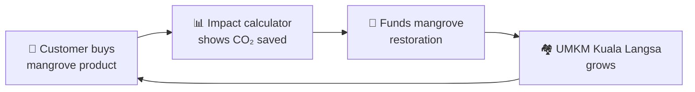

<div align="center">


<br/>


</div>

---

## 🖥️ `~/terminal`

```text
┌── jo@labs ─────────────────────────────────────────┐
│ $ whoami                                           │
│ Jo · 20 y/o · Informatics Engineering (Sem. 5)     │
│ Software Engineering track @ Universitas Teuku Umar│
│                                                    │
│ $ current-focus                                    │
│ Fullstack (React + Express) · Python · Java OOP    │
│ Practical AI/ML · Tech for sustainability          │
│                                                    │
│ $ next-destination                                 │
│ RECONSA 2026 delegate → Master's in DE / ES        │
│                                                    │
│ $ mindset                                          │
│ Learn by building. Improve with every commit.      │
└────────────────────────────────────────────────────┘
```

---

## 👨‍💻 `~/about-me`

| | |
|---|---|
| 🎓 **Academics** | 5th-semester Informatics Engineering student at **Universitas Teuku Umar (UTU)**, specializing in Software Engineering |
| 🌏 **Mission** | Preparing as a delegate for **RECONSA 2026** (SDG 11: Sustainable Cities & Communities) |
| ✈️ **Next level** | Aiming for a Master's degree in **Germany or Spain** |
| 💻 **Development** | Learning through hands-on fullstack projects: APIs with Node.js/Express, UIs with React, OOP with Java |
| 🐧 **Environment** | Comfortable in Linux (**Ubuntu & Fedora**) and testing endpoints with Postman |
| 🌿 **Impact** | Using tech for environmental and community good, especially empowering local **UMKM** |
| 🏋️ **Beyond code** | Gym (never skipping leg day), hybrid running, and unwinding with books like Tere Liye's *Hujan* |

---

## 🧰 `~/tools-in-my-workbench`

<div align="center">


</div>

| Layer | Tools |
|---|---|
| 🎨 **Frontend** | React · JavaScript · HTML/CSS |
| ⚙️ **Backend** | Node.js · Express.js · REST APIs |
| 🧠 **AI / Data** | Python · Machine Learning (learning in public) |
| ☕ **OOP** | Java · MySQL |
| 🚀 **DevOps & Workflow** | Git · GitHub · Vercel · Postman · Linux |

---

## 🌱 `~/featured-project`

### 🥥 Mangrovise
> An e-commerce platform that empowers **Kuala Langsa UMKM** while restoring mangrove ecosystems.

| Pillar | What it means |
|---|---|
| 🛒 **Buy** | Browse and purchase mangrove-based products from a clean, responsive online store |
| 🌍 **Impact** | See the environmental impact of every purchase through a built-in impact calculator |
| 🌳 **Restore** | Turn purchases into real restoration efforts for coastal conservation |



---

## 🚀 `~/other-projects`

| Project | Description | Stack |
|---|---|---|
| 🌾 **AgriSense AI** | ML-based proposal to optimize the rice production cycle, supporting national food self-sufficiency | `Python` `ML` |
| 🐄 **SIMOSAPI** | Medical management and vaccination scheduling system for cattle, built for an OOP course | `Java` `MySQL` |
| 📦 **Eco-Track Gateway** | Supply-tracking REST API server, deployed on Vercel | `Express.js` `Node.js` |
| 🔐 **Emergency Digital Consent** | Blockchain-based emergency consent system concept for student competitions | `Blockchain` |

---

## 🗺️ `~/quest-log`

- [x] Build first fullstack project (React + Express)
- [x] Ship a REST API to production on Vercel
- [x] Design an impact-driven e-commerce platform
- [ ] Represent at **RECONSA 2026** 🌏
- [ ] Level up AI/ML skills with real datasets
- [ ] Apply for a Master's in **Germany / Spain** 🎓
- [ ] Hit a new PR on leg day 🦵

---

## 📊 `~/github-activity`

<div align="center">


<br/>


</div>

---

## 🔄 `~/currently`

```bash
while learning; do
  build_something
  learn_from_it
  improve_the_next_version
  # gym break: leg day 🦵
done
```

---

<div align="center">

### 🤝 Let's build something together

[](https://github.com/jordanslabs)

<sub>⭐ If something here helped you, drop a star. It keeps the lab lights on.</sub>


</div>
